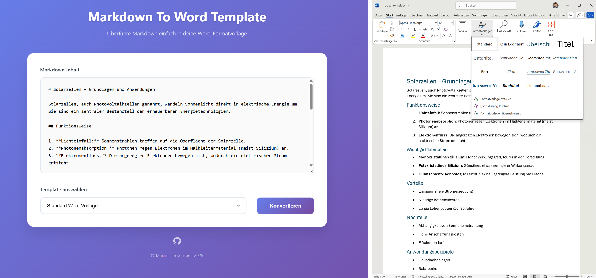

# Markdown To Word Template

Eine moderne Web-App mit Python-Backend, die Markdown-Inhalte zuverlässig in professionell gestaltete Word-Dokumente mit individuellen Formatvorlagen verwandelt – für konsistente, hochwertige Ergebnisse auf Knopfdruck.

## 🎯 Problem & Lösung

KI-Tools sind heute fester Bestandteil vieler Workflows, besonders bei der Generierung längerer Textdokumente. Das nachträgliche Formatieren kann jedoch zeitaufwendig und inkonsistent sein. Diese App löst das Problem durch automatisiertes Mapping von Markdown-Syntax auf Word-Formatvorlagen.



## ✨ Features

- **Moderne Web-UI** mit intuitivem Design
- **Template-System** mit Möglicher Ablage vorgefertigter Word-Vorlagen
- **Custom Templates** - Option eigene .docx-Vorlagen über den Browser hochzuladen
- **Responsive Design** - Funktioniert auf Desktop und Mobile

## 🚀 Quick Start (Lokal)

### 1. Repository klonen
```bash
git clone https://github.com/mgiesen/Markdown-To-Word-Template.git
cd Markdown-To-Word-Template
```

### 2. Pandoc Binary installieren
Die App benötigt Pandoc für die Markdown→Word-Konvertierung. Lade die entsprechende Binary herunter:

**Windows:**
1. Download: https://github.com/jgm/pandoc/releases/latest
2. Lade `pandoc-[version]-windows-x86_64.zip` herunter
3. Extrahiere `pandoc.exe` nach `backend/pandoc/pandoc.exe`

**Linux:**
1. Download: https://github.com/jgm/pandoc/releases/latest  
2. Lade `pandoc-[version]-linux-amd64.tar.gz` herunter
3. Extrahiere `pandoc` nach `backend/pandoc/pandoc`

**macOS:**
1. Download: https://github.com/jgm/pandoc/releases/latest
2. Lade `pandoc-[version]-macOS.zip` herunter  
3. Extrahiere `pandoc` nach `backend/pandoc/pandoc`

### 3. Backend starten
```bash
cd backend
pip install -r requirements.txt
python server.py
```
API läuft auf: http://localhost:8081

### 4. Frontend starten
```bash
cd backend
python webserver.py
```
Frontend läuft auf: http://localhost:5500

### 5. Verwenden
1. Öffne http://localhost:5500
2. Gib Markdown-Content ein
3. Wähle ein Template oder lade eigenes hoch
4. Klicke "Konvertieren" → Download startet automatisch

## 🏗️ Architektur

```
├── frontend/           # Modern JavaScript SPA
│   ├── index.html      # UI mit Markdown-Editor
│   ├── script.js       # Template-Management & API-Calls  
│   └── styles.css      # Responsive Design
├── backend/
│   ├── server.py       # Flask API (Port 8081)
│   ├── webserver.py    # Static Frontend Server (Port 5500)
│   ├── templates/      # Standard Word-Templates
│   └── user-templates/ # Upload-Bereich für Custom Templates
```

**Tech Stack:**
- **Frontend:** Vanilla JavaScript, moderne CSS
- **Backend:** Python Flask + Pandoc 
- **Konvertierung:** pypandoc für Word-Generation
- **Templates:** .docx-Dateien mit Formatvorlagen

## 📋 Template-Management

### Standard Templates
Platziere .docx-Dateien in `backend/templates/` und registriere sie in der `index.json`:

```json
[
  {
    "filename": "business-report.docx", 
    "description": "Business Report Template"
  }
]
```

### Custom Templates
- Benutzer können .docx-Dateien direkt über die Web-UI hochladen
- Unterstützt alle Word-Formatvorlagen und Designs
- Maximale Dateigröße: 25MB

## 🔧 Entwicklung

**API-Endpunkte:**
- `GET /api/health` - Health Check
- `GET /api/templates` - Verfügbare Templates
- `POST /api/upload-template` - Custom Template Upload
- `POST /api/convert` - Markdown → Word Konvertierung

**Lokale Entwicklung:**
- Frontend erkennt localhost automatisch
- CORS für Cross-Origin-Requests konfiguriert
- Hot-Reload über Python-Webserver

## 🙏 Danksagung

Powered by:
- [Pandoc](https://pandoc.org/) - Universal Document Converter
- [Flask](https://flask.palletsprojects.com/) - Python Web Framework

**⭐ Star das Repo wenn es dir hilft!**